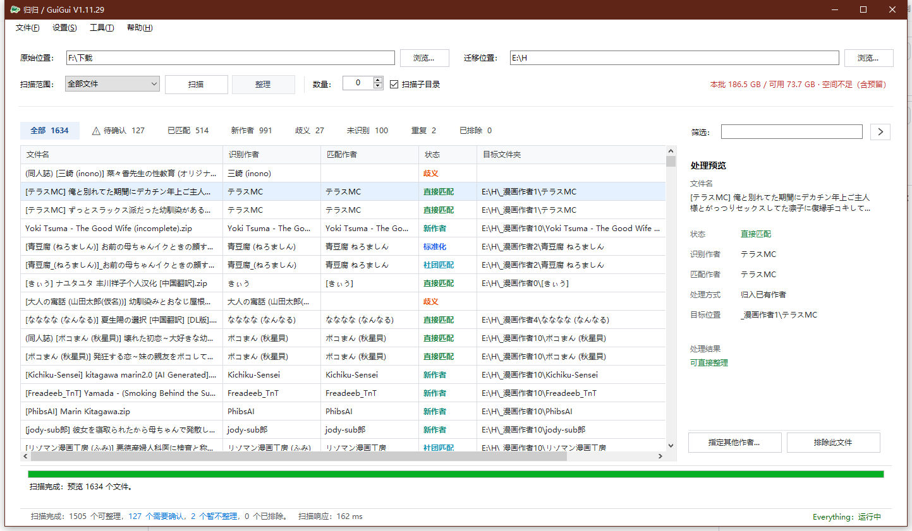
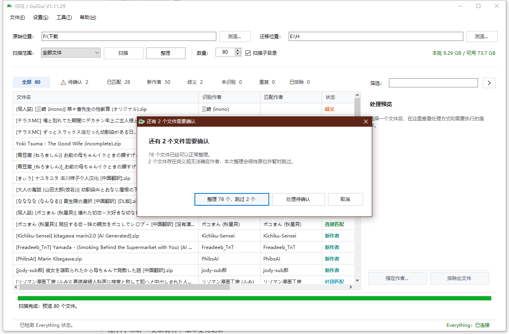
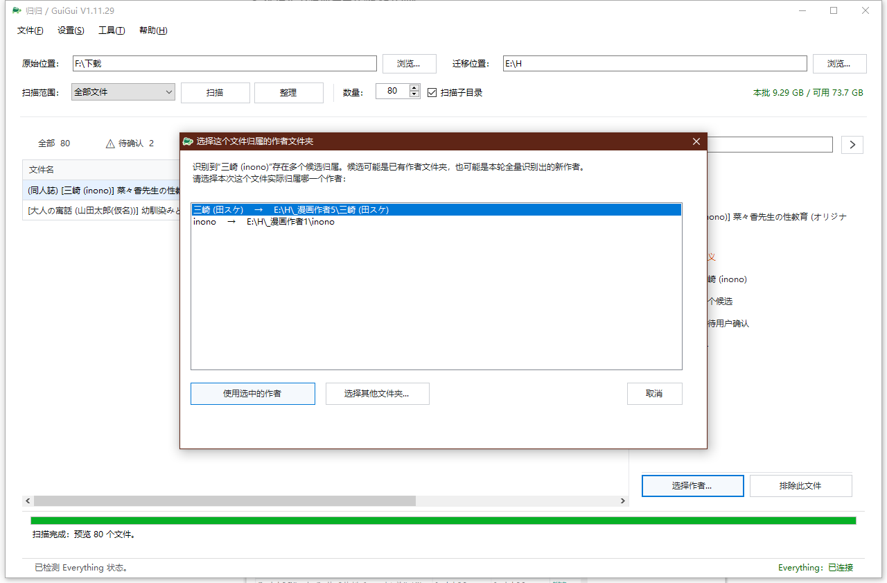

## V1.13.10 高级数据源合并性能修复

- 修复大量 E-Hentai Tag Aggregate 标签合并时的未索引关联子查询，加入分组优化。
- 合并期间状态显示“正在合并公共库（已运行 N 秒）”，进度条不再提前显示 100%。
- 大型合并支持暂停、继续、取消；已完成的来源过滤证据会保留，可重试合并。
- 当前只提供 .NET Framework 4.8 源码，需在 Windows 运行 BUILD_EXE.cmd 生成 EXE；尚未在当前环境实机编译。

## V1.13.9 编译修复
修复高级来源下载 `DownloadAsync` 遗漏的暂停控制参数：该问题导致 `CS0103` 和 `CS1501`。仍使用原有 .NET Framework 4.8 编译脚本 `BUILD_EXE.cmd`，无须安装 .NET 8。本版保持 V1.13.8 的高级构建功能，等待 Windows 编译与运行验收。

## V1.13.8 Windows 编译清单修复
修复 V1.13.7 高级构建 5 个新增源文件路径格式导致的 CS1504。`BUILD_EXE.cmd` 现会先执行 `Build/ValidateSources.ps1`，检查 79 个编译文件是否存在且与项目一致。用户无需单独移动 `.cs` 文件。功能与 V1.13.7 一致；仍需 Windows 编译验收。

## V1.13.7 高级构建三来源可视化管理
归归内置 **E-Hentai Current / nh-metadata-archive / E-Hentai Tag Aggregate** 三个来源卡片。高级窗口提供逐源检查、下载、选择、过滤和移除原始库的操作。
CSV 继续按 Git Blob SHA 增量下载；大型 SQLite 独立存放于 `AuthorDbSources`，不随归归分发。GZIP 可内置解压；ZSTD 需要将 `zstd.exe` 放入 `Modules` 目录或使用 PATH 中可信程序，或者手动选择解压后的 `.db` 文件。处理完成将生成待重启激活的公共索引。
若现有公共库不是 Schema v4，请先备份，优先下载新版开发者索引；也可以通过「新建空库」明确从零重建（旧数据不自动迁移）。

## V1.13.6 统一公共库更新

普通用户可以下载开发者发布的 Schema v4 公共索引（需配置公开 manifest）；日常 CSV 按 SHA 增量合并，高级模式可从空库完整导入历史 CSV。无需 .NET 8。使用与发布方式见 `Docs/PUBLIC_INDEX_RELEASE_V1.13.6.md`。

# 归归 / GuiGui 使用说明

[简体中文](README.md) | [English](README_EN.md)

[下载](https://github.com/kendoyae/GuiGui-MangaAuthorSorter/releases) [https://github.com/kendoyae/GuiGui-MangaAuthorSorter/releases](https://github.com/kendoyae/GuiGui-MangaAuthorSorter/releases)

## 归归黄淡思，逐郎还去来；归归黄淡思，逐郎何处索？

如果你和我一样喜欢把作者按文件夹分类，那么归归非常适合你。

归归是一款 Windows 漫画文件作者识别与归档工具。它会扫描指定位置，根据文件名识别作者或社团，并在执行前展示整理预览。识别命名规则基于Ehentai默认下载的日文名称。个别文件需要手动。软件不含任何下载，所有操作只针对本地文件进行归档。

## 一、快速开始

1. 在“原始位置”选择需要扫描的文件夹。
2. 在“迁移位置”选择作者归档目录。
3. 根据需要设置扫描范围、递归扫描和扫描数量。
4. 点击“扫描预览”。
5. 检查识别结果、目标目录和待确认项目。
6. 确认无误后点击“执行整理”。

归归不会在扫描预览阶段移动文件。只有在执行确认后，符合条件的文件才会被整理。

## 二、识别结果

- 直接匹配：文件名中的作者与已有作者目录直接一致。
- 标准化：仅存在安全的字符、空格或括号形式差异。
- 别名匹配：通过作者实体库中的别名找到对应作者。
- 社团匹配 / 作者匹配：从结构化名称中识别社团或作者。
- 新作者：未找到已有目录，计划创建新的作者目录。
- 待确认：存在多个候选或信息不足，需要人工选择。
- 未识别：无法可靠判断作者，不会自动整理。
- 已排除：命中排除规则，不参与本次整理。

## 三、处理待确认项目

选中待确认或未识别项目后，可以指定已有作者、新作者或排除此文件。归归以安全为优先，不会在多个候选之间自动任选一个。

## 四、常用设置

- 文件类型方案：决定哪些扩展名进入扫描。
- 标签清洗规则：移除文件名中不会代表作者的标签。
- 扫描排除规则：跳过不应参与归档的文件。
- 作者实体库：在 AuthorEntities.json 页面统一新增、编辑、删除作者和社团，维护别名、关系、公共覆盖及冲突。
- 归档设置：调整分组数量、目录命名和磁盘安全预留。

## 五、Everything（加速推荐使用）

<mark>Everything 支持是可选的。可用时归归会优先使用它加快文件发现；不可用时会自动使用 Windows 文件系统扫描，不影响基本功能。</mark>

## 六、数据与安全

用户设置、作者别名、整理历史及规则文件会在首次使用或保存设置时创建在程序目录。升级或移动 EXE 前，建议保留这些数据文件。

执行整理前请检查预览结果。涉及大量文件时，建议先使用少量文件验证目录和命名设置，并保留必要备份。

## 七、检查更新

通过“帮助 → 检查更新”或“关于归归”检查 GitHub Releases。归归只展示正式版本信息并打开官方下载页面，不会自动下载安装或覆盖 EXE。

## 八、帮助入口

- 使用说明：查看本操作指南。
- 更新说明：查看各版本新增、修复与优化记录。
- 性能诊断：诊断扫描性能；普通使用建议保持默认设置。
- 关于归归：查看当前版本、项目主页、许可证和反馈入口。

V1.12.8：非递归扫描仅查询当前目录（Everything 使用 parent:）；按需补齐子目录索引。首次扫描与索引数据库同步分开计时。详见 `Docs/INDEX_SCOPE_V1.12.8.md`。

作者实体库 V1.12.10：新增、编辑、删除作者与别名，管理公共覆盖、关系及冲突。旧 TXT 只供导入。[使用与验收说明](Docs/UNIFIED_AUTHOR_LIBRARY.md)。

## V1.13.5 作者公共数据库增量更新

- 用户下载的 `nh-metadata-archive` CSV 经统一过滤，作品证据先写入 `GuiGuiReferenceEvidence.db`，再按 `GuiGuiAuthorIndex.db.official-base` 基线生成 `GuiGuiAuthorIndex.db.pending`。
- 下一次启动前会检查 SHA-256 和来源版本，随后原子切换数据库并保留 `.pre-merge.bak`。若官方数据库被其他操作更新，不会用旧 pending 文件覆盖它。
- 追加的名字只能通过相同 provider tag 或唯一的跨来源精确键与既有实体关联；不因同一作品包含两个作者就将其合并。
- 没有 `GuiGuiAuthorIndex.db` 时，不能执行公共库合并；应先部署构建器生成的公共库。
- 首次启动/官方库升级后可能需要再次执行“重新校验”，以使新的参考证据与实体状态一致。
- 保留原 `AuthorEntities.json`，不会因公共库更新而改写。
