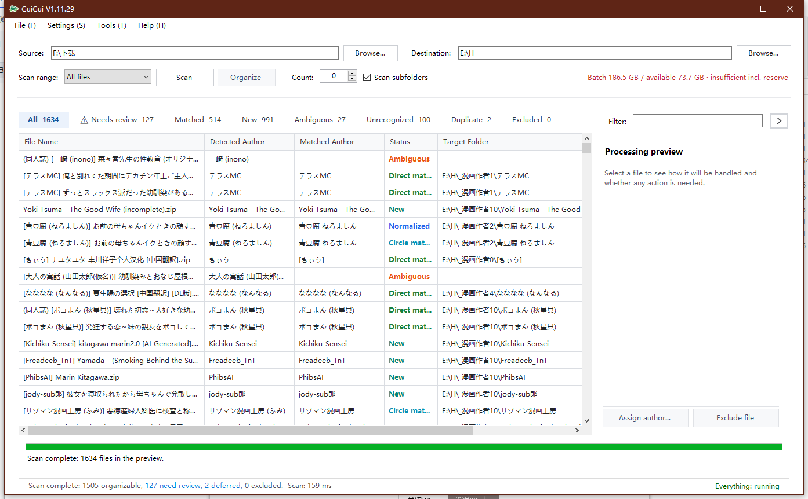
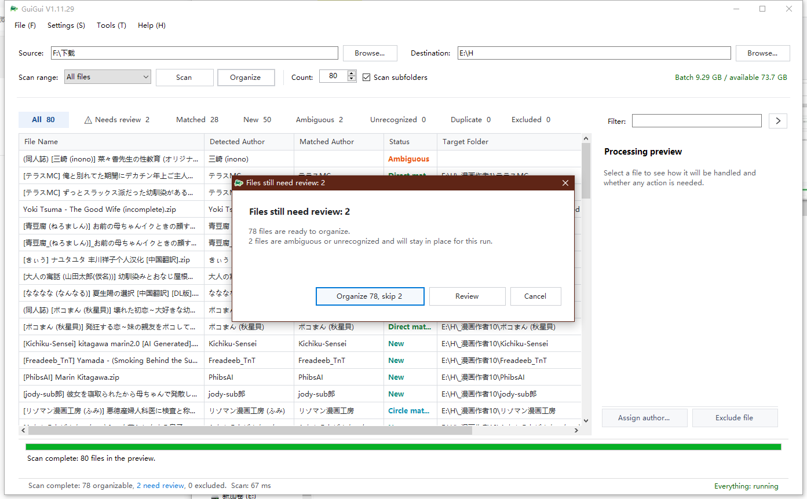
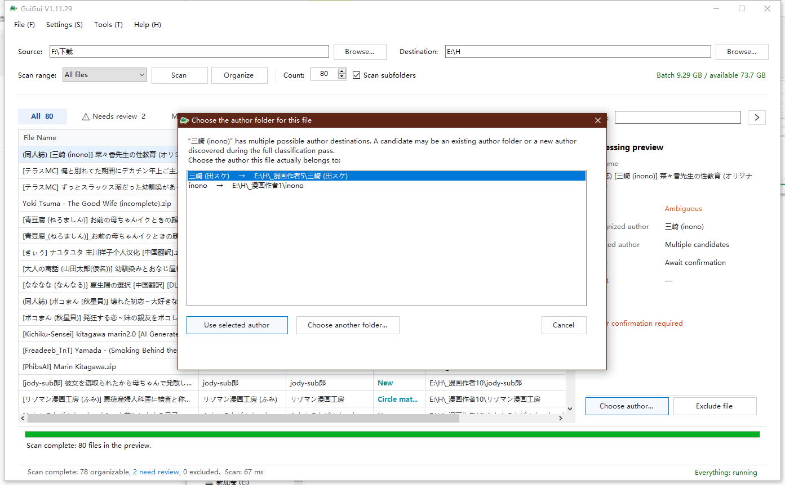

# GuiGui User Guide

[简体中文](README.md) | [English](README_EN.md)

[Download](https://github.com/kendoyae/GuiGui-MangaAuthorSorter/releases) [https://github.com/kendoyae/GuiGui-MangaAuthorSorter/releases](https://github.com/kendoyae/GuiGui-MangaAuthorSorter/releases)

**Gui Gui, wan with yearning,**  
**follows her love through coming and going;**  
**Gui Gui, faint with longing—**  
**where now shall she seek her beloved?**

If, like me, you enjoy organizing authors into separate folders, GuiGui may be just what you need.

GuiGui is a Windows tool for identifying manga authors and organizing local files. It scans a selected location, identifies authors or circles from file names, and presents an organization preview before making any changes. Its recognition rules are based on the default Japanese titles used for downloads from E-Hentai. Some files may require manual handling. GuiGui contains no download functionality; all operations are limited to organizing local files.

## 1. Quick Start

1. Under **Source Location**, select the folder you want to scan.
2. Under **Destination Location**, select the author archive directory.
3. Configure the scan scope, recursive scanning, and scan limit as needed.
4. Click **Scan Preview**.
5. Review the recognition results, destination directories, and items requiring confirmation.
6. When everything is correct, click **Organize Files**.

GuiGui does not move files during the preview scan. Eligible files are organized only after you confirm the operation.

## 2. Recognition Results

- **Direct match:** The author in the file name exactly matches an existing author directory.
- **Normalized:** The names differ only in safe character, spacing, or bracket variations.
- **Alias match:** The corresponding author was found through the author alias library.
- **Circle match / Author match:** A circle or author was identified from a structured file name.
- **New author:** No existing directory was found, so a new author directory is planned.
- **Confirmation required:** Multiple candidates exist or there is insufficient information, so manual selection is required.
- **Unrecognized:** The author cannot be identified reliably, so the file will not be organized automatically.
- **Excluded:** The file matches an exclusion rule and will not participate in the current operation.

## 3. Handling Items Requiring Confirmation

After selecting an item that requires confirmation or was not recognized, you can assign it to an existing author, create a new author, or exclude the file. GuiGui prioritizes safety and will not automatically choose between multiple candidates.

## 4. Common Settings

- **File type profiles:** Determine which file extensions are included in scans.
- **Tag cleaning rules:** Remove file-name tags that do not represent authors.
- **Scan exclusion rules:** Skip files that should not be included in organization.
- **Author alias library:** Maintain alternate spellings or names for the same author.
- **Archive settings:** Adjust grouping quantities, directory naming, and reserved disk space.

## 5. Everything

<mark>Everything integration is optional. When available, GuiGui uses it to discover files more quickly. If it is unavailable, GuiGui automatically falls back to Windows file-system scanning without affecting core functionality.</mark>

## 6. Data and Safety

User settings, author aliases, organization history, and rule files are created in the program directory when GuiGui is first used or when settings are saved. Keep these data files when upgrading or moving the EXE.

Review the preview before organizing files. When processing many files, first verify your directory and naming settings with a small sample, and keep any necessary backups.

## 7. Checking for Updates

Use **Help → Check for Updates** or **About GuiGui** to check GitHub Releases. GuiGui displays official release information and opens the official download page; it does not automatically download, install, or overwrite the EXE.

## 8. Help Menu

- **User Guide:** View this guide.
- **Release Notes:** Review additions, fixes, and improvements in each version.
- **Performance Diagnostics:** Diagnose scan performance; the default settings are recommended for normal use.
- **About GuiGui:** View the current version, project homepage, license, and feedback links.
